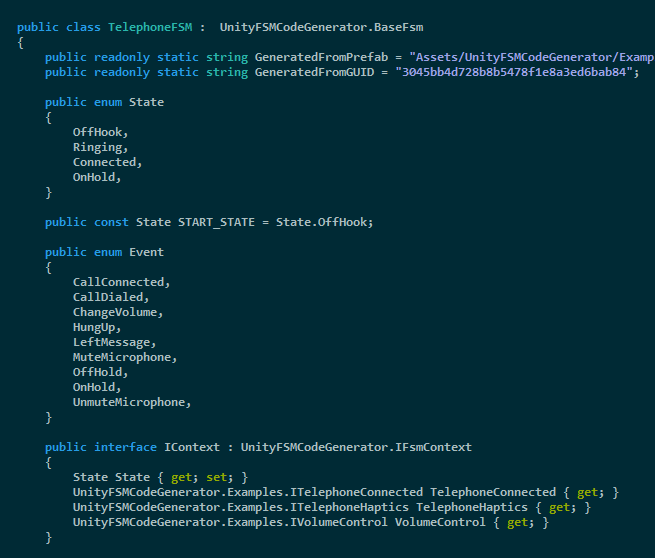
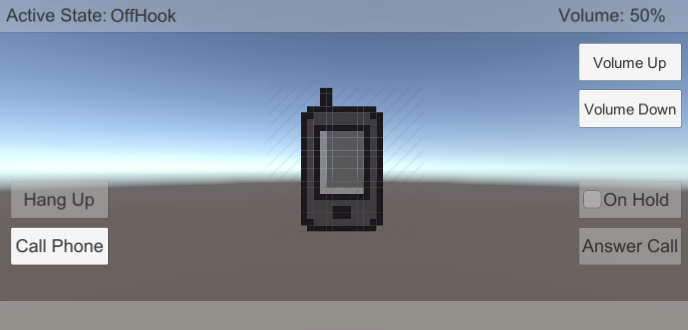
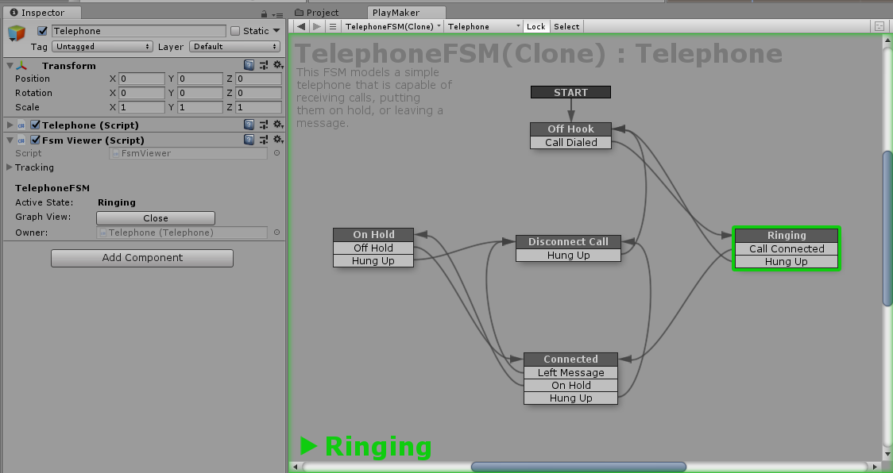

# Unity FSM Code Generator
A code generation tool for Unity that can convert a declarative PlayMaker FSM into a pure C# finite state machine.

**Note:** This tool will not convert a regular PlayMaker FSM containing standard actions into C# code. See [PlayMaker Comparison](#playmaker-comparison) below.

**Contents**
* [Motivation](#motivation)
* [Gory Details](#gory-details)
* [How to Use](#how-to-use)
* [PlayMaker Comparison](#playmaker-comparison)
* [Examples](#examples)
  * [Telephone](#telephone)
* [Status](#status)
* [Extras](#extras)

## Motivation

Coding a finite state machine by hand is tedious. And error prone. Usually we just get lazy and throw a bunch of if-then-else statements in a function and hope for the best.

There are great libraries for building an FSM in code (see <https://github.com/dotnet-state-machine/stateless>), but I still find the machine definitions hard to understand despite the syntactic sugar.

Thankfully there is a great visual FSM designer on the Unity asset store: [PlayMaker](https://www.assetstore.unity3d.com/en/#!/content/368).

PlayMaker is awesome at what it does: visual imperative coding. But it won't help you if you are a programmer trying to manage the complexity of your C# code. You're still stuck writing an FSM by hand, or accepting a fragile approximation via if-then-else statements littered everywhere.

Wouldn't it be great if you could visually design this:

And through some hand-wavy magic end up with this:

And not be forced by hand to write this:

Just to call your fancy well-architected code like this:

**Well now you can!**

## Gory Details

This library contains a collection of custom PlayMaker actions you can use to define a declarative FSM -- i.e. one that defines the logic of *what you want do and when*, but does not itself contain the *how*. That sounds kind of pointless, but in practice it means you let the FSM deal with all the annoying if-then-else state management and you write the fun stuff.

The FSMs generated by this library are themselves completely stateless. You provide interface implementations via simple dependency injection, a place to store the state, call SendEvent in response to external stimuli, and like boring magic your methods get called when they should.

Additionally there is no reflection used at runtime (only when parsing and building the FSM in the editor), so interface method calls are inlined and easy to debug in the generated code. Garbage is also not generated as the queued event system under the hood pools the allocated classes.

Once a C# FSM is generated from a PlayMaker FSM, you can copy and paste and share the C# FSM code as it has zero dependencies on PlayMaker (or even Unity). 

Additionally, if you hate yourself or are too cheap or broke to spend $65 on PlayMaker, you can manually create the data model used by the code generator. I wouldn't recommend it though. It's possible I could implement an add-on to the tool that could parse out a Mechanim state machine and give roughly the same workflow as the PlayMaker one, but don't count on it.

## How to Use

The intended workflow when using this library would be that you colocate your generated FSM C# script right next to the GameObject prefab continaing your `PlayMakerFSM`, and put them both wherever you put your other C# scripts.

For instance, you might design an enemy Orc in this way:

- **`Scripts/Enemies/OrcBehaviour.cs`**: A MonoBehaviour that would interact with Unity and control the interesting logic -- such as pathfinding, physics, or a character controller. Would also send events directly to the generated OrcAiFsm FSM in response to things happening, like being attacked.

- **`Scripts/Enemies/OrcAiFsm.prefab`**: Would contain a PlayMaker FSM with states such as "Patrolling", "Idle", "Dead", transitions amongst each state, and OnEntry/OnExit/Internal actions for calling interface methods on the class in OrcBehaviour.cs.
    
- **`Scripts/Enemies/OrcAiFsm.Generated.cs`**: Contains the C# FSM generated from the prefab. Inside your Orc.cs class you would create an instance of this FSM and send events into it.

If you are a hands on learner, see the [telephone example](#telephone) that comes bundled with this project.

## PlayMaker Comparison

**PlayMaker**
- Visually script your game and make things happen with actions.
- Doesn't require any coding.
- Can reference a UnityEngine.Object, but doesn't support using C# interfaces natively.
- Visually debug the state of your FSM with the PlayMaker GUI.
- Intended to assist non-programmers in creating gameplay, but is still very useful to programmers.
- Cool name.

**UnityFSMCodeGenerator**
- Nothing happens without C# code implementing behavior and sending events to the FSM.
- Requires coding.
- Requires interface-based design and dependency injection.
- Can hook into the PlayMaker GUI to visually debug your generated C# FSM. (see [Extras](#extras) below).
- Intended to assist programmers, but can still be used by non-programmers to change behavior.
- Horrible name.

## Examples

### Telephone

The project contains an implementation of a simple telephone similar to the [phone call example in stateless](https://github.com/dotnet-state-machine/stateless/blob/dev/example/TelephoneCallExample/PhoneCall.cs) but with sounds, animation, pixel art, and UI buttons to control the phone. I mean, we're game developers right? Why not have all that stuff.

It utilizes two FSMs, one to control the state of a phone call and the other to control the volume.

- [`Examples/Telephone/Telephone.cs`](UnityFSMCodeGenerator/Examples/Telephone/Telephone.cs) - The business logic and core interfaces for controlling the telephone in the TelephoneExample.unity scene.

- `Examples/Telephone/TelephoneFSM.prefab` - Contains a `PlayMakerFSM` defining the states and transitions for the telephone and a `PlayMakerCodeGenerator` that takes care of compilation of the FSM.

- [`Examples/Telephone/TelephoneFSM.Generated.cs`](UnityFSMCodeGenerator/Examples/Telephone/TelephoneFSM.Generated.cs) - The code generated by compiling the TelephoneFSM.prefab.

- `Examples/Telephone/TelephoneVolumeFSM.prefab` - Contains a `PlayMakerFSM` defining the the control of telephone volume.

- [`Examples/Telephone/TelephoneVolumeFSM.Generated.cs`](UnityFSMCodeGenerator/Examples/Telephone/TelephoneVolumeFSM.Generated.cs) - The code generated by compiling the TelephoneVolumeFSM.prefab.

It's immediately noticeable looking at `Telephone.cs` that there are almost zero if-then-else checks related to the state that the telephone is in. The generated FSM `TelephoneFSM.Generated.cs` takes care of all that tedium and only the interesting stuff remains in `Telephone.cs`. Even handling UI events like button clicks are as simple as calling `SendEvent` on the FSM.

**Note:** You will need your own copy of PlayMaker to be able to modify or view the visual FSM, but the example will work perfectly fine without it. 

## Status

Alpha, but functional.

Transitions, enter/exit callbacks, internal action callbacks, and code generation by introspection into a PlayMaker FSM all working.

Still needs much more documentation, unit tests, support for IgnoreEventAction, better error handling in the UI, potentially support for delegate arguments (maybe), and a bunch of other stuff.

**Note:** Right now the editor side of things is using the `CompilationPipeline` class added in Unity 2017.3. I will try and kludge together a fallback option for older versions of Unity.

## Extras

There is a `FsmViewer` component you can add to a GameObject that will automatically discover and show information for any FSMs on that GameObject. All you need to do is have your MonoBehaviour inherit `IHaveBaseFsms` and FsmViewer will take care of the rest. For an FSM to be found it must also have been generated with 'Enable Introspection Support' in the PlayMakerCodeGenerator compiler options.

If you have PlayMaker installed, FsmViewer will even locate the original prefab the generated FSM was made from and let you use the PlayMaker UI to visually view the state of the FSM!

